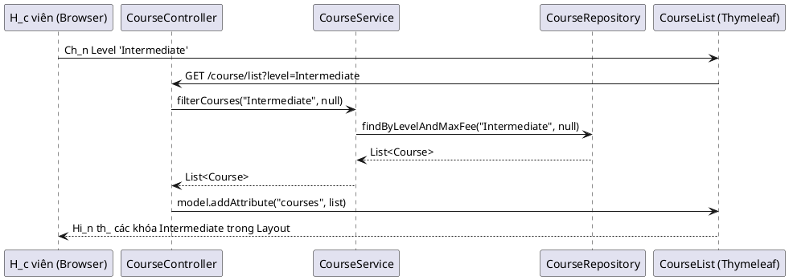
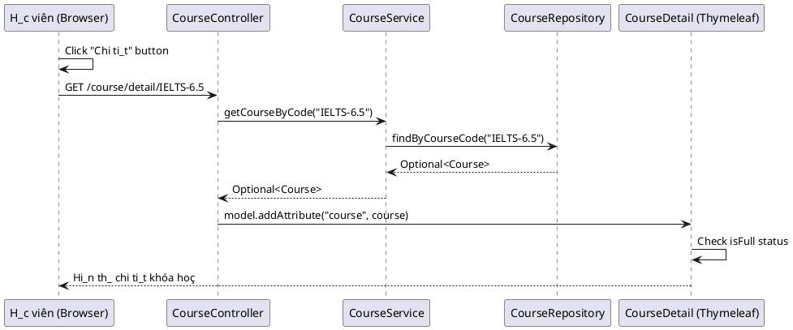
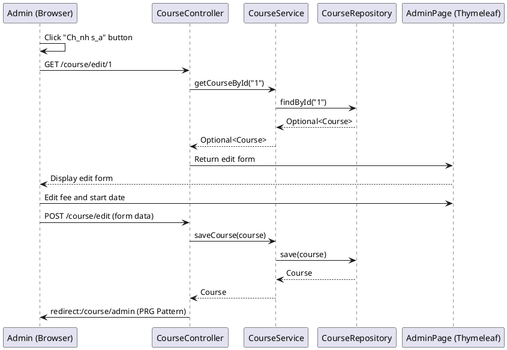
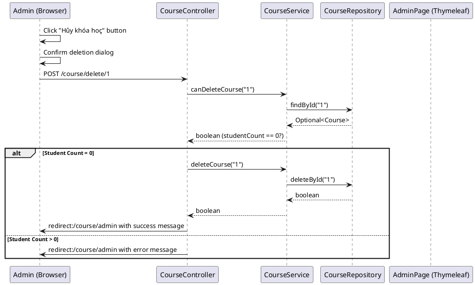
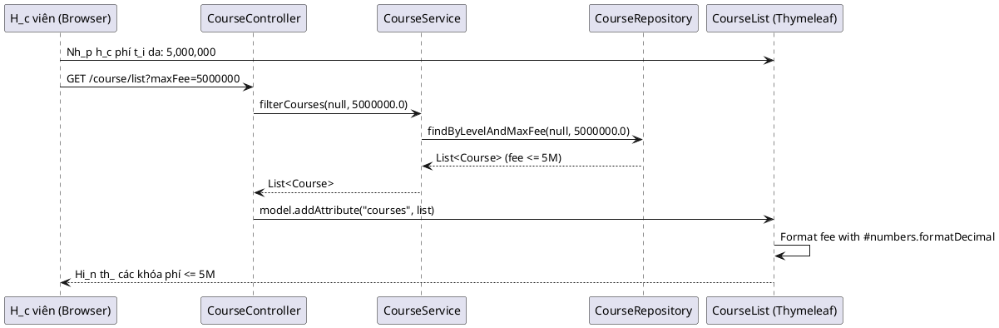
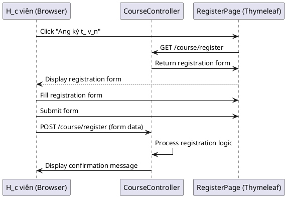
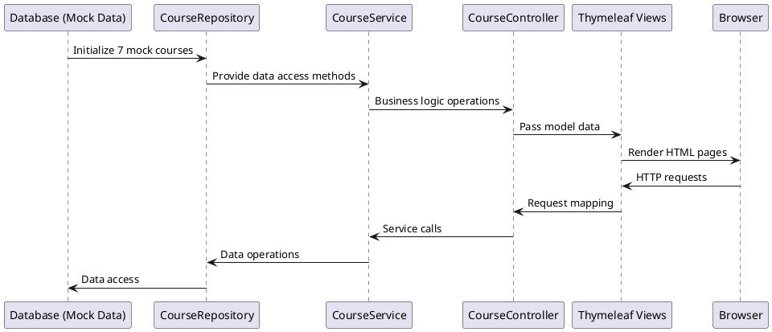

# EDU-PATH Business Flow Diagrams

## 1. Tra_cú theo trình d_ (Level Filter)

## 2. Xem chi ti_t khóa hoç (Course Detail)

## 3. C_p nh_t thông tin khóa hoç (Admin Update)

## 4. Hûy khóa hoç (Delete Course)

## 5. L_c khóa hoç theo h_c phí (Fee Filter)

## 6. Ang ký t_ v_n (Registration Flow)

## 7. Lu_ng d_ li_u h_th_ng (System Data Flow)

